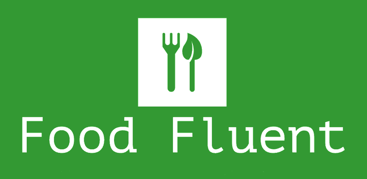

<strong>Restaurant finder</strong>

A web app for finding restaurants compatible with a group's food restrictions and diet profiles :fork_and_knife: 

  

 

---

  
### Quick Links

  

  

---

### TEXT 🥳 🚀

-
---

 

**[PROJECT PHILOSOPHY](INSERT-URL-HERE) •
[TECH STACK] // TBC•
[CONTRIBUTING] // TBC•
[SPREAD THE WORD]// TBC•
[LICENSE](https://github.com/sofofos/food-fluent/blob/master/LICENSE.md)**

 

# 🧐 Project philosophy

> INSERT TEXT
> 
>

# 👨‍💻 Tech stack

Here's a brief high-level overview of the tech stack food-fluent uses:

- This project uses the [LABEL](URL). DESCRIPTION
- For persistent storage (database), the app uses the [LABEL](URL)

- The app uses the font [FONT](URL) as its main font (insert reference to use for future front end refactoring ie: material design)

# ✍️ Contributing

Interested in contributing to food fluent project? Thanks so much for your interest! We are always looking for improvements to the project and contributions from open-source developers are greatly appreciated.

If you have a contribution in mind, please check out our [Contribution Guide](URL) for information on how to do so. Also, make sure you read our [Code of Conduct](https://github.com/chroline/well_app/wiki/Code-of-Conduct) to foster an encouraging sense of community.
// TO DO: WRITE GUIDELINES FOR CONTRIBUTION AND CoC

# 🌟 Spread the word!

If you want to say thank you and/or support active development of food-fluent:

- Add a GitHub Star to the project!
- Tweet about the project on your Twitter!
  - Tag [@sofofos_](https://twitter.com/colegawin_) and/or `#foodfluent`

Thanks so much for your interest in growing the reach of food fluent!

# ⚠️ License

food fluent is free and open-source software licensed under the GNU General Public License v3.0.

 

---

 

# 💛

// TODO: Blurb about montreal menu database project
